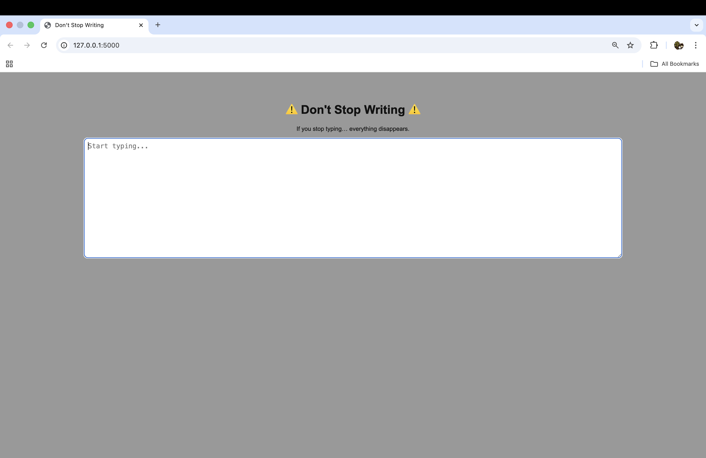

# ✍️ Don't Stop Writing

A simple web app that forces you to keep writing — if you stop typing for a few seconds, everything you wrote disappears.

## 📸 Preview



## 🚀 Features

- ⏱ Real-time typing detection
- 💥 Automatically clears text if you stop typing
- ⚡ Instant feedback with no page reloads
- 🎯 Minimal and distraction-free UI

## 🛠 Tech Stack

- Python (Flask) — serves the app
- HTML — structure
- CSS — styling
- JavaScript — core logic (timers + input detection)

## 🧠 How It Works

- The app listens for user input in the textarea
- Every keystroke resets a timer
- If the user stops typing for a few seconds:
  - The timer triggers
  - The text is cleared instantly

## ▶️ Run Locally

1. Clone the repository:
```bash
git clone https://github.com/YOUR_USERNAME/day-90-disappearing-text-writing-app.git
cd day-90-disappearing-text-writing-app

## 👤 Author

**Sijan Thapa**
